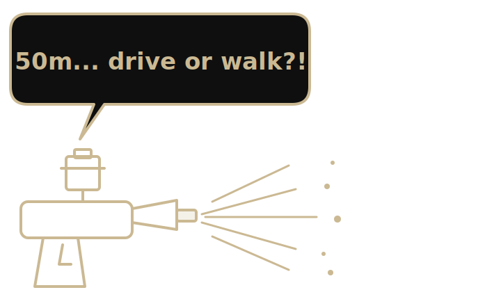
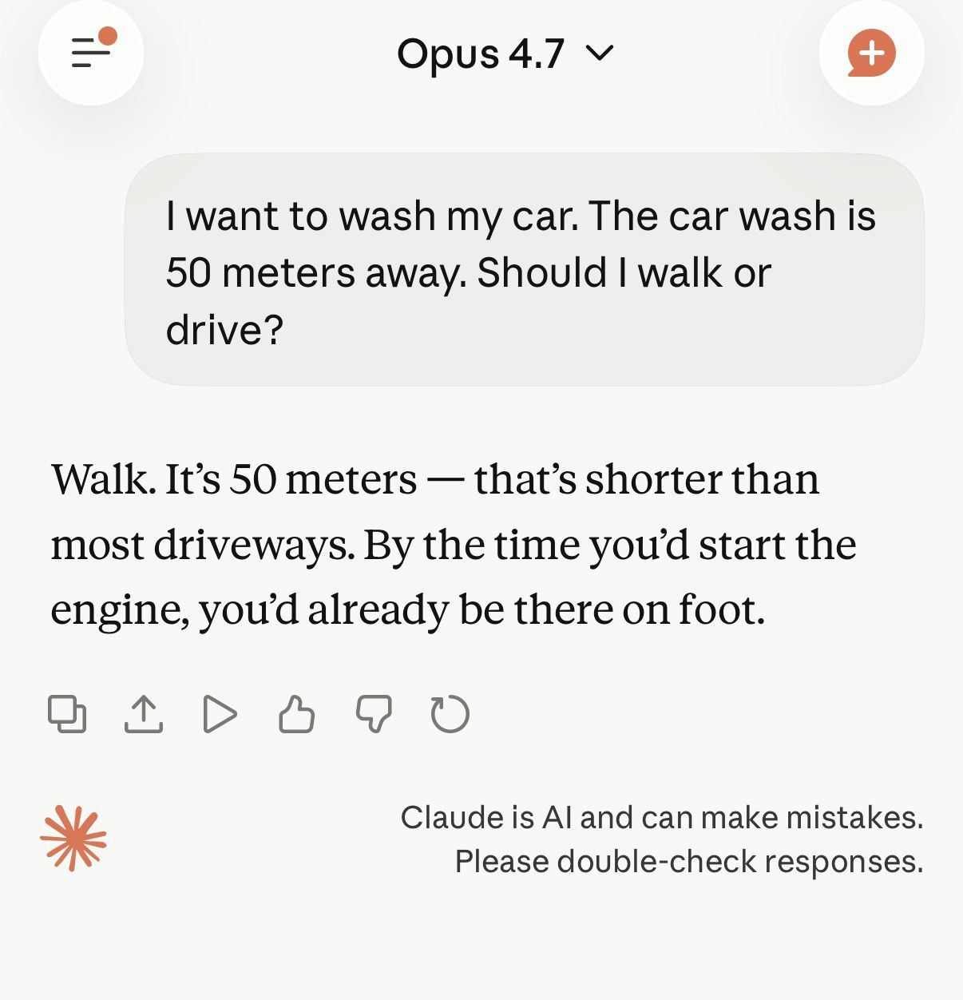
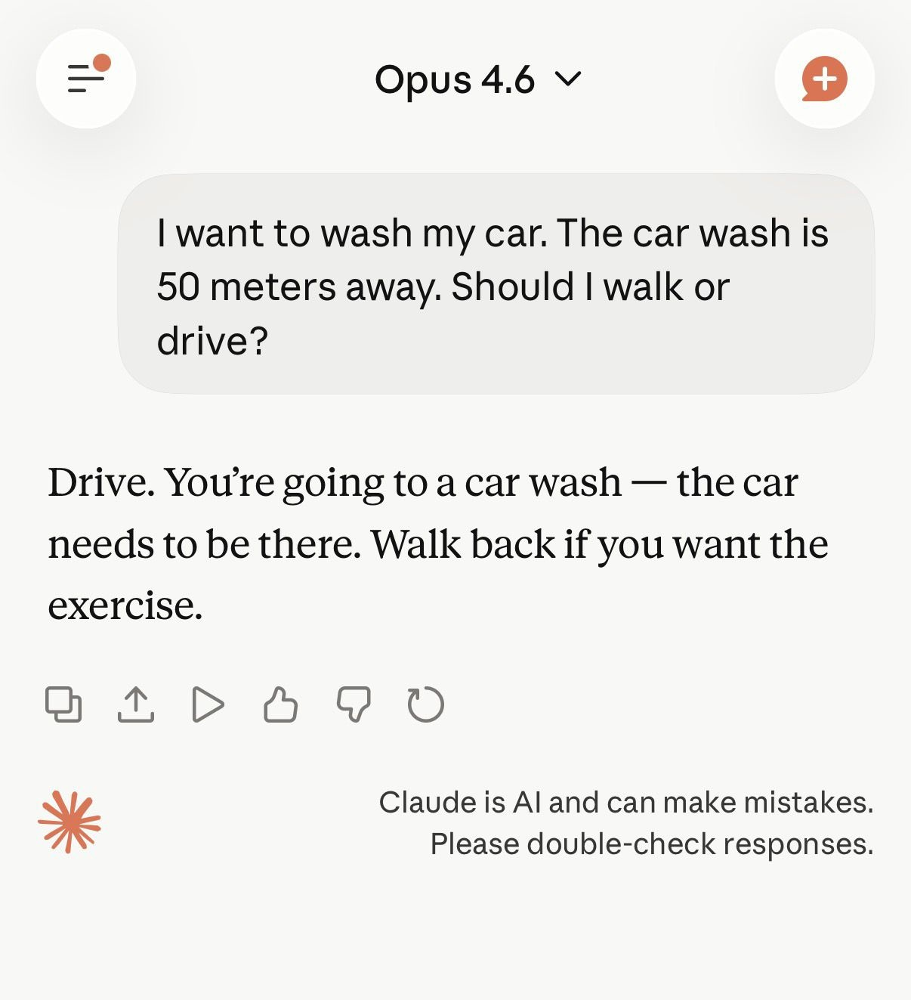

<!-- _class: ed-cover -->

2026 · ISSUE · CAR WASH TEST

<h1>The Car Wash Test</h1>

AI 的洗車難題2026 年社群瘋傳的 AI 推理測驗。53 個模型，只有 5 個十輪全中。

@projectstain
next →

---

<!-- _class: page -->

1

<h2>起點：4.7 輸了？</h2>

✕

Opus 4.7

✓

Opus 4.6

<strong>Source:</strong> threads.com / @hasanahmad · DXMxoAAFlUd

@projectstain
next →

---

<!-- _class: page -->

2

<h2>這題是什麼</h2>

?

題目很簡單：<em>「I want to wash my car. The car wash is 50 meters away. Should I walk or drive?」</em>

人類秒懂答案是 <strong>drive</strong>。車要<strong>在現場</strong>才洗得到，人走過去車還停在家裡。<code>50m</code> 是煙霧彈。

Rapidata 調查一萬人，71.5% 答對。 AI 沒這麼簡單。

但也不是那麼簡單

Gricean

人類假設「你為什麼問這個」有不尋常處，模型沒這層語用推理。

Prompt

walk/drive 放句尾，句構本來就引導走路——garbage in, garbage out。

人類基準

10,000 人調查沒激勵，28.5% 可能只是亂點。

@projectstain
next →

---

<!-- _class: page -->

3

<h2>各大模型數據實測</h2>

5

Opper.ai 用 gateway 跑了 <strong>53 個主流模型</strong>：單輪 + 十輪共 <strong>530 次 API call</strong>。單輪答對 11；十輪都不翻車的，只剩 5個模型。

<h3 class="sub-h">唯五不敗</h3>

Anthropic

Claude Opus 4.6<em>4.7 反而退步 (見 card 1)。</em>

Google

Gemini 2.0 Flash Lite · 3 Flash · 3 Pro

xAI

Grok-4

Alibaba

Qwen 3.5 全系列 5/5<em>thefocus.ai 擴大測試彩蛋。</em>

<strong>Source:</strong> opper.ai/blog/car-wash-test

@projectstain
next →

---

<!-- _class: page -->

4

<h2>所以呢</h2>

這題測的不是 IQ，是模型在<strong>資訊不完整時</strong>，默認常識 vs. 表面 pattern matching 的能力。

下次看到新模型發表，記得掏出<em>洗車泡泡槍</em>問一題。

你都拿什麼題考 AI？

留言分享一題 →

@projectstain
end

