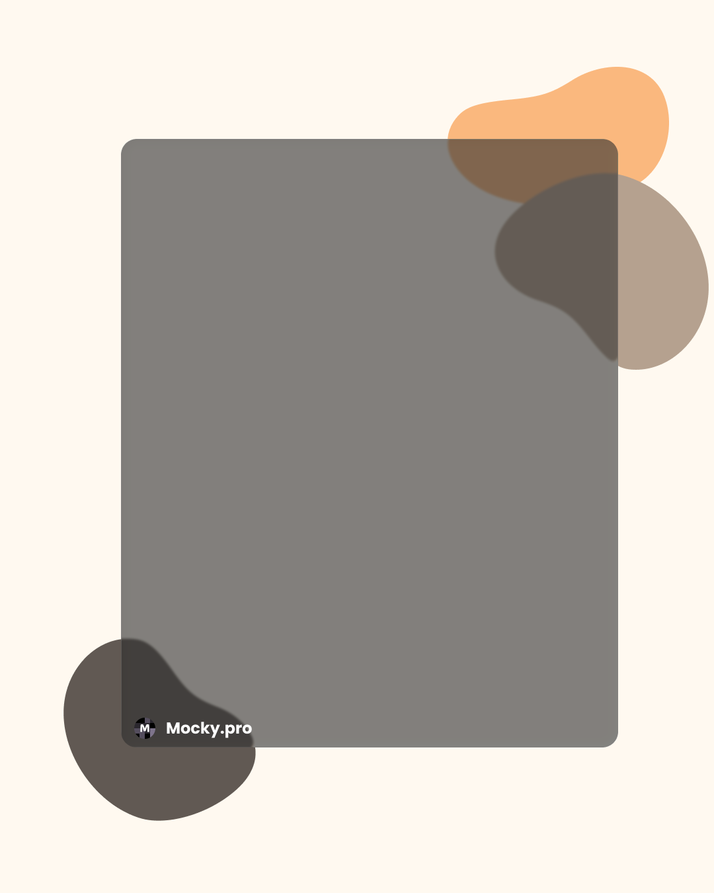
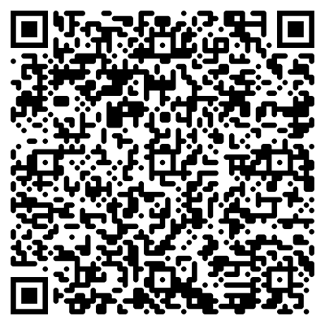
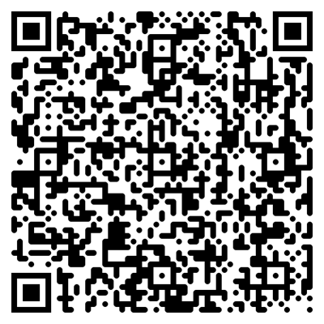

<!-- _class: cover -->

  

# The Walt Disney Company 華特迪士尼 2026 Marketing Intern 行銷實習生

  
2026 外商實習 69

---

# 實習工作內容

  

    
campaign

    <h2>社群經營</h2>
    
Disney Style TW 官方 Facebook 與 Instagram 帳號日常維運

  

  

    
movie

    <h2>短影音創作</h2>
    
商品資料收集、腳本撰寫、拍攝與後製剪輯一條龍

  

  

    
handshake

    <h2>網紅合作</h2>
    
安排網紅開箱體驗，協助品牌曝光與社群擴散

  

  

    
psychology

    <h2>行銷企劃</h2>
    
與團隊共同執行行銷活動，並提供創意發想與建議

  

  
2026 外商實習 69

---

# 申請資格一覽

  

    <h2>✓ 基本條件</h2>
    <ul>
      <li>行銷、公關或數位多媒體相關科系</li>
      <li>熟悉社群平台與短影音創作</li>
      <li>熟練 Outlook、PowerPoint、Word、Excel</li>
      <li>中英文流利</li>
    </ul>
  

  

    <h2>★ 加分特質</h2>
    <ul>
      <li>具社群內容創作經驗</li>
      <li>有創意、具團隊合作精神</li>
      <li>良好溝通能力</li>
      <li>熱愛 Disney 品牌與 IP 內容</li>
    </ul>
  

  
2026 外商實習 69

---

# 重要資訊

  

    
地點

    
台北 / 新北

  

  

    
到班時間

    
每週至少 3 天

  

  

    
招募單位

    
Disney Experiences

  

  

    
投遞狀態

    
Actively Hiring

  

  
2026 外商實習 69

---

# 掃碼申請 & 模擬面試

  

    
    <h2>立即申請</h2>
    
掃描 QR Code 前往官方申請頁面

  

  

    
    <h2>AI 模擬面試</h2>
    
掃描 QR Code 前往 Mocky.pro 練習

  

  
2026 外商實習 69

